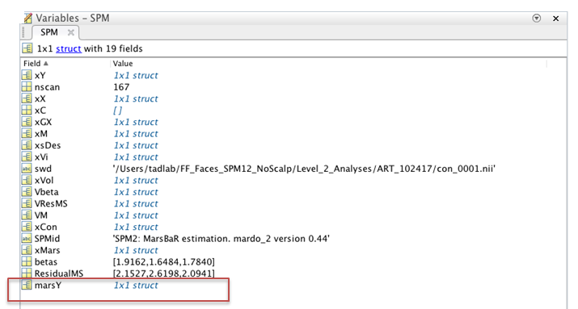

# How to Extract Data from the Amygdala Using MarsBaR
- Protocol Developed by Kristen Stauffer
- Webpage Developed by Andie Bulbin

## Step 1: Open and Set Up MATLAB
1. Open MATLAB
1. Type the following in the command line:
- $ addpath(genpath(‘PATH TO SPM12’))
- $ cd /PATH FOR NO SCALP IMAGING DATA DIRECTORY
- $ spm fmri
- NOTE: chane the file paths based on what version of SPM you are using and where you are getting the Level 2

## Step 2: Open MarsBaR
1. Click on Toolbox menu and select marsbar

## Step 3: Define the Design to Extract Data From
1. Click on "Design" from the MarsBaR menu
1. Select "Set design from file"
1. Go to Level_2_Analyses Folder
1. Click on the analysis folder that you want to extract the data from (e.g. ART_102417)
1. Click on the con_XXXX folder that you want to extract data from
1. Select the SPM.mat file

## Step 4: Define the Parameter to Extract the Data
1. Click on the "Data" from the MarsBaR menu
2. Select "Extract ROI Data" (full options):
3. Define the ROI(s) that you are going to extract from
- Scroll to the template folder
- Select the ROIs that you want to use: in this example, LAmy_aal_roi.mat, RAmy_aal_roi.mat, and BiAmy_AAL_roi.mat
4. When it asks "Use SPM design?" select "Yes"
5. When it asks "Images from:" select "SPM design"
6. Scaling from: "raw data"
7. Scale grand mean to (0=raw), change the value from 50 to 0 and press "Enter"

## Step 5: Estimate the Results
1. Click on "Results" from the MarsBaR menu
1. Select "Estimate results"

## Step 6: Save the Extracted Values to a .mat File
1. Click on "Results" from the MarsBaR menu
1. Select "Save results to file"
1. Go to the Level_2_Analyses folder that you are extracting data from (e.g. ART_102417)
1. Select the “Extracted_Data” folder
1. Name the file with the con number, ROIs you extracted from, and the date (e.g. con_0001_LAmy_RAmy_BiLat_102717)
1. Press "Save"

## Step 7: Add the Values to the Extracted Value Spreadsheet
1. Outside of MATLAB, go to the Extracted_Data folder in the Level 2 Analyses folder that you saved the data to (e.g. …/Level_2_Analyses/ART_102417/Extracted_Data) and select the .mat file that you extracted data from
2. When you select this file, it will ask to import the file into MATLAB. When the "Import Wizard" window pops up in MATLAB, just press "Finish". This will create a variable called "SPM" in the Workspace on the right hand side of the MATLAB window
3. Double-click on the SPM variable. This will open the Variable in the Variables portion of the MATLAB window
4. Double-click on the "marsy" subvariable

5. Double-click on the Y variable. This will open a spreadsheet in MATLAB with the extracted values data in it. They won't have any column headers, but will appear in the order which you selected the ROIs. If you need a reminder of the order, you can double click on "Regions" once you are inside the marsY variable. That will open up a spreadsheet that looks like the one below (with as many cels filled in as regions that you selected). Double click on each of the cells for the name of the ROI file that each column represents

6. Copy and paste the values from the spreadsheet into the Excel document called "Faces_Amygdala_Extracted_Values". Make sure you are pasting the values into the correct con columns and double check, actually triple check, that the ROIs match up. Make sure you are in the correct page in the Excel doc.
7. Also double check that the number of subjects matches up. They should, but if they do not, you can select the "info" filed in the marsY variable field

8. Double-click on the VY field.
9. In the spreadsheet that this opens up, look at the fname column for the filepaths for all of the images included in the Level 2 analysis
10. You can then compare the values inthe fname column with the ID column in the Excel document
